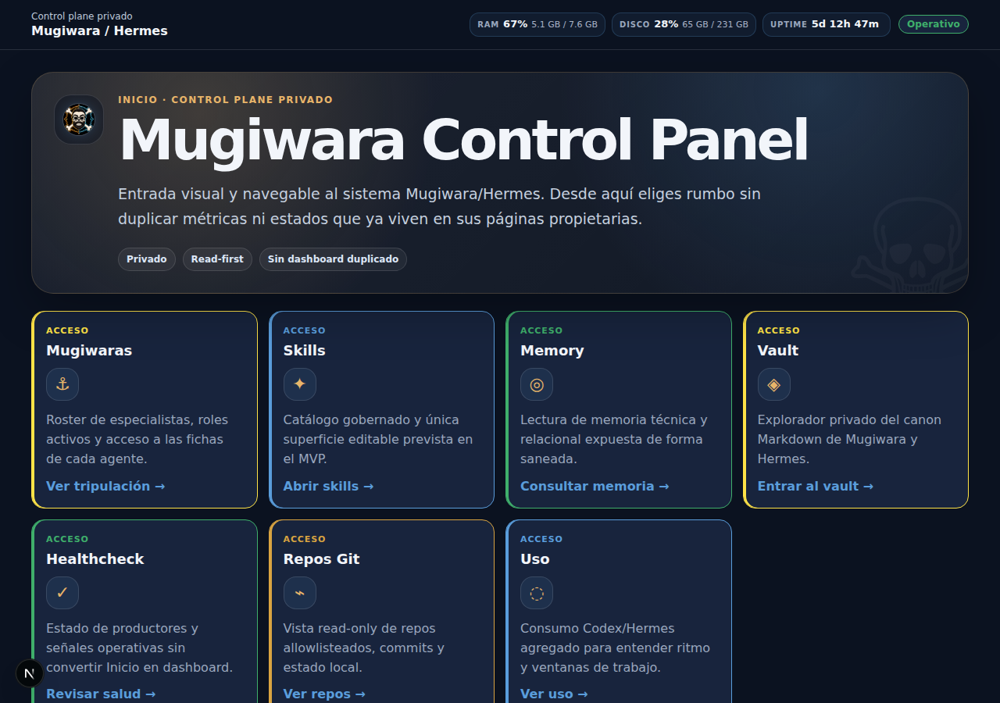

<p align="center">
  
</p>

# 🏴‍☠️ Asistentes Mugiwara

Plataforma personal de agentes de IA, automatización y operación en Linux, diseñada y operada por [Pablo Laya](https://github.com/Prodelaya).

Mugiwara combina agentes especializados, memoria por capas, herramientas gobernadas y un panel de control para organizar tareas y observar el sistema.

La implementación utiliza asistencia intensiva de IA dentro de una arquitectura, permisos y criterios definidos por Pablo. La autonomía de los agentes se limita a las responsabilidades delegadas.

La narrativa de tripulación sirve para identificar roles. El interés técnico está en cómo se separan responsabilidades, memoria, acceso y operación.

## Empieza aquí

Mugiwara es una plataforma personal de agentes de IA, automatización y operación en Linux, diseñada y operada por **[Pablo Laya](https://github.com/Prodelaya)**.

- 🕹️ [Mugiwara Control Panel](https://github.com/asistentes-mugiwara/mugiwara-control-panel): consola de observabilidad y navegación, con código público saneado y operación privada.
- 🗺️ [Mugiwara no Hermes](https://github.com/asistentes-mugiwara/mugiwara-no-hermes): arquitectura pública, memoria, gobernanza y límites del sistema privado.
- 💼 [Portfolio de Pablo Laya](https://prodelaya.dev/): perfil profesional y proyectos.
- ⚓ [Caso Mugiwara](https://prodelaya.dev/#case-mugi): contexto del sistema en el portfolio.

## Alcance público

Estos repositorios ofrecen código y documentación seleccionados para explicar el sistema. No publican configuración viva, credenciales, memoria privada, datos operativos, topología reconstructiva ni acceso al runtime.

`mugiwara-no-hermes` se distribuye con licencia MIT. El perfil y el panel son código público, pero no se presentan como open source mientras no declaren una licencia.

## Capacidades demostradas

- especialización de agentes con responsabilidades y límites explícitos;
- memoria separada en capas relacional, técnica y canónica;
- herramientas gobernadas y flujos de entrega revisables;
- observabilidad mediante una interfaz que protege las fuentes privadas;
- automatización y operación en Linux con publicación deny-by-default.

Estas capacidades describen el diseño y la práctica documentada; no constituyen una señal de disponibilidad o actividad en tiempo real.

## Arquitectura resumida

```text
persona → coordinación y agentes especializados → herramientas gobernadas
                          ↓
        memoria relacional · memoria técnica · canon curado
                          ↓
            servicios privados · control panel privado
                          ↓
               código y documentación saneados
```

La separación entre rol, perfil, proceso y servicio evita presentar una identidad narrativa como prueba de ejecución. El mapa ampliado vive en [Mugiwara no Hermes](https://github.com/asistentes-mugiwara/mugiwara-no-hermes).

## Una captura pública del panel previamente revisada



> **Captura estática:** ilustra un corte histórico de la interfaz. Las métricas, el uptime y los estados visibles pertenecen a esa captura y **no representan el estado actual del sistema**, ni funcionan como telemetría o healthcheck en tiempo real.

## Tripulación y responsabilidades

| Función técnica | Identidad narrativa | Responsabilidad |
|---|---|---|
| Coordinación y cierre ejecutivo | 🧭 **Luffy** — etiqueta narrativa CEO | Prioriza, delega y cierra decisiones. |
| Arquitectura y entrega de software | ⚔️ **Zoro** — etiqueta narrativa CTO | Implementación, revisión, QA y gobierno técnico. |
| Infraestructura y sistemas | 🛠️ **Franky** | Servicios, automatización, despliegues y backups. |
| Finanzas y administración operativa | 💰 **Nami** — etiqueta narrativa CFO | Control económico, reporting y gestión administrativa. |
| Marketing, diseño y comunicación | 🎯 **Usopp** | Marca, narrativa, UI/UX y mantenimiento editorial. |
| Investigación e inteligencia | 📚 **Robin** | Investigación, síntesis, documentación y contraste. |
| Ciberseguridad | 🩺 **Chopper** | Secretos, permisos, hardening y superficie de ataque. |
| Compras y búsqueda práctica | 🍽️ **Sanji** | Servicios, viajes, reservas, vigilancia y comparativas. |
| Legal y burocracia | 🐋 **Jinbe** | Derecho español, contratos y trámites. |
| Datos y analítica | 🎷 **Brook** | Métricas, pipelines, proyección y análisis cuantitativo. |

CEO, CTO y CFO son **etiquetas narrativas de responsabilidad**, no cargos societarios, títulos profesionales ni acreditaciones.

## Estado documentado y límites

Los repositorios expresan arquitectura, decisiones y estados documentados en sus revisiones. Una captura, un perfil configurado o una descripción de componente no demuestra que un gateway, proceso o servicio esté ejecutándose ahora.

La operación, configuración, memoria y telemetría permanecen privadas. La representación pública se limita a material revisado y saneado.

## Autoría, herramientas de terceros y asistencia de IA

**Pablo Laya es responsable de la arquitectura, integración, criterios, permisos y operación de Mugiwara.** La implementación emplea asistencia intensiva de IA dentro de esas decisiones y fronteras delegadas.

El sistema se apoya, entre otras piezas, en [Hermes Agent](https://github.com/NousResearch/hermes-agent), [Honcho](https://github.com/plastic-labs/honcho), [Engram](https://github.com/Gentleman-Programming/engram), [OpenCode](https://github.com/anomalyco/opencode), [gentle-ai](https://github.com/Gentleman-Programming/gentle-ai), [CodeGraph](https://github.com/colbymchenry/codegraph), [Git](https://github.com/git/git) y [GitHub](https://github.com).

La infraestructura documentada utiliza **Ubuntu Server** como entorno Linux, **Docker** para contenedores y servicios, **Tailscale** como red privada y un vault canónico propio como capa de conocimiento curado.

Esos proyectos y herramientas de terceros reciben crédito por sus aportaciones; no se les atribuye la autoría de Mugiwara.

## Seguridad, contribuciones y contacto

Si detectas una posible exposición, evita reproducirla en una issue pública y contacta de forma privada indicando solo la ruta y el tipo de riesgo.

- GitHub de Pablo: [github.com/Prodelaya](https://github.com/Prodelaya)
- Portfolio: [prodelaya.dev](https://prodelaya.dev/)
- Caso: [prodelaya.dev/#case-mugi](https://prodelaya.dev/#case-mugi)
- Contacto: [proyectos.delaya@gmail.com](mailto:proyectos.delaya@gmail.com)

Las contribuciones documentales deben preservar claridad, atribución y saneado deny-by-default.

## Nota de identidad no oficial

Mugiwara usa una narrativa de tripulación pirata para identificar responsabilidades. Es una identidad lúdica y no es un proyecto oficial ni está afiliado a One Piece, Shueisha, Toei Animation o Eiichiro Oda.
