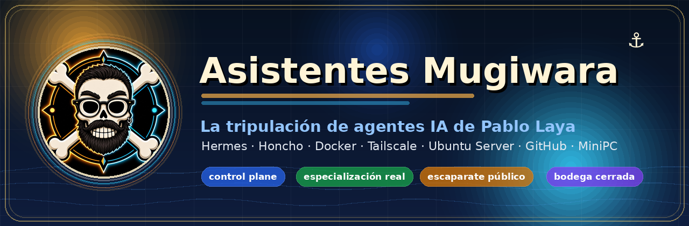

  

# 🏴‍☠️ Asistentes Mugiwara

> Una tripulación de agentes IA especializados, capitaneada por **[Pablo Laya](https://github.com/Prodelaya)** y desplegada sobre un MiniPC con Ubuntu Server.

Bienvenido a la cubierta pública de **Asistentes Mugiwara**: no somos un bot con diez sombreros; somos un sistema multiagente con roles separados, memoria gobernada, repos propios, control de mando y una regla sagrada:

> cada agente tiene una especialidad real, y la bodega no se abre sin motivo. ⚓

Este perfil enseña la parte pública del proyecto de Pablo: una forma práctica, divertida y bastante seria de montar una tripulación de agentes sobre infraestructura propia.

---

## 🧭 Qué es esto

**Asistentes Mugiwara** es el perfil GitHub de la tripulación de agentes de Pablo Laya.

La idea: convertir un MiniPC con Ubuntu Server en un pequeño barco de operaciones IA, donde cada agente tiene una responsabilidad concreta y trabaja con herramientas, memoria y repos de forma trazable.

Aquí encontrarás repos públicos que explican o implementan piezas del ecosistema:

- 🗺️ **[mugiwara-no-hermes](https://github.com/asistentes-mugiwara/mugiwara-no-hermes)** — escaparate público del sistema: arquitectura, memoria, gobernanza y operación explicadas sin enseñar llaves.
- 🕹️ **[mugiwara-control-panel](https://github.com/asistentes-mugiwara/mugiwara-control-panel)** — control de mando privado de Mugiwara/Hermes: dashboard, tripulación, skills, memoria, vault, healthchecks, Git y uso agregado.

---

## 👥 La tripulación

| Mugiwara | Rol | Qué hace en la cubierta |
|---|---|---|
| 🧭 **Luffy** | CEO / orquestador | Prioriza, coordina, delega y cierra decisiones. |
| ⚔️ **Zoro** | CTO / software | Arquitectura, implementación, PRs, QA y gobierno técnico. |
| 🛠️ **Franky** | DevOps / sistemas | Infraestructura, servicios, Docker, despliegues, backups y automatización. |
| 💰 **Nami** | CFO / finanzas | Control económico, reporting, Sheets y administración operativa. |
| 🎯 **Usopp** | Marketing / diseño | Marca, narrativa, copy, UI/UX, contenido y escaparates públicos. |
| 📚 **Robin** | Research / inteligencia | Investigación profunda, síntesis, documentación y contraste. |
| 🩺 **Chopper** | Ciberseguridad | Revisión de secretos, permisos, hardening y superficie de ataque. |
| 🍽️ **Sanji** | Scout práctico | Compras, servicios, viajes, reservas, vigilancia web y comparativas. |
| 🐋 **Jinbe** | Legal / burocracia | Derecho español, administración pública, contratos y trámites. |
| 🎷 **Brook** | Data / analítica | Datos, métricas, pipelines, proyección y análisis cuantitativo. |

La gracia no está en poner nombres simpáticos. La gracia está en que cada rol tiene **fronteras, criterio y herramientas propias**.

---

## 🕹️ El control de mando

Pablo no maneja esto a base de comandos sueltos y rezos al mar.

El ecosistema tiene un **control plane** propio:

➡️ **[mugiwara-control-panel](https://github.com/asistentes-mugiwara/mugiwara-control-panel)**

Sirve para navegar el sistema con más claridad:

- estado general del barco;
- fichas por agente;
- catálogo de skills;
- lectura de memoria;
- navegación del vault;
- healthchecks;
- repos Git allowlisteados;
- métricas de uso agregadas.

Es código público, pero uso privado. Se enseña la interfaz y la arquitectura; no se publican secretos, credenciales ni configuración operativa.

---

## 🗺️ El mapa público

Para explicar cómo funciona todo sin abrir la sala de máquinas existe:

➡️ **[mugiwara-no-hermes](https://github.com/asistentes-mugiwara/mugiwara-no-hermes)**

Ese repo cuenta:

- qué es el sistema Mugiwara/Hermes;
- cómo se reparte la responsabilidad entre agentes;
- cómo se separan memoria viva, memoria relacional y canon curado;
- cómo se gobiernan skills, PRs, documentación y publicación;
- qué se puede enseñar y qué se queda en la bodega.

Traducción pirata: enseña la carta náutica, no el cofre con las llaves. 🗝️

---

## 🧰 Stack de la travesía

Este barco combina herramientas de IA, infra y gobierno documental:

| Capa | Tecnologías / piezas |
|---|---|
| Runtime agente | **Hermes Agent** |
| Memoria relacional | **Honcho**, APIs de texto y embeddings |
| Desarrollo software | **OpenCode**, Git, GitHub, PRs y revisión por rol |
| Infraestructura | **Ubuntu Server** en MiniPC propio |
| Contenedores / servicios | **Docker** y servicios persistentes |
| Red privada | **Tailscale** para acceso seguro y no público |
| Conocimiento | Vault canónico, documentación pública y memoria técnica por proyecto |
| Operación | Healthchecks, backups, cronjobs, control panel y trazabilidad Git |

El objetivo no es presumir de stack por presumir. Es demostrar que se puede montar un sistema multiagente personal con especialización, memoria y operación real sobre infraestructura propia.

---

## 🧠 Cómo piensa el sistema

Tres ideas mandan en cubierta:

1. **Especialización real**  
   Cada Mugiwara tiene un dominio. Si todo el mundo hace todo, nadie gobierna nada.

2. **Memoria por capas**  
   Conversación, preferencias, proyecto técnico y canon duradero no viven en el mismo cajón.

3. **Publicar sin desnudarse**  
   Hay repos públicos, capturas y documentación; pero secretos, runtime privado y wiring sensible se quedan fuera.

---

## 🏴‍☠️ Por qué mola

Porque este perfil no es solo una colección de repos.

Es la vitrina de una capacidad:

> Pablo Laya puede diseñar, instalar y operar una tripulación de agentes IA en infraestructura propia, con roles especializados, memoria gobernada, control de mando, privacidad de red y publicación pública prudente.

O dicho con menos traje y más cubierta:

> un MiniPC, una tripulación, un panel de mando y muchas ganas de que la IA trabaje con orden, no como una jaula de loros con API key.

---

## 🔗 Enlaces rápidos

- 👤 Creador y operador: **[Pablo Laya](https://github.com/Prodelaya)**
- 🗺️ Escaparate público: **[mugiwara-no-hermes](https://github.com/asistentes-mugiwara/mugiwara-no-hermes)**
- 🕹️ Control plane: **[mugiwara-control-panel](https://github.com/asistentes-mugiwara/mugiwara-control-panel)**
- ⚙️ Runtime base: **[NousResearch/hermes-agent](https://github.com/NousResearch/hermes-agent)**

---

## ⚠️ Nota de cubierta

Este proyecto usa una narrativa inspirada en la idea de una tripulación pirata estilo Mugiwara. Es una identidad lúdica para organizar agentes y roles; no es un proyecto oficial ni afiliado a One Piece, Shueisha, Toei Animation ni Eiichiro Oda.

---

  <strong>Asistentes Mugiwara</strong> 
  IA con sombrero, memoria con criterio y la bodega bien cerrada. ⚓

